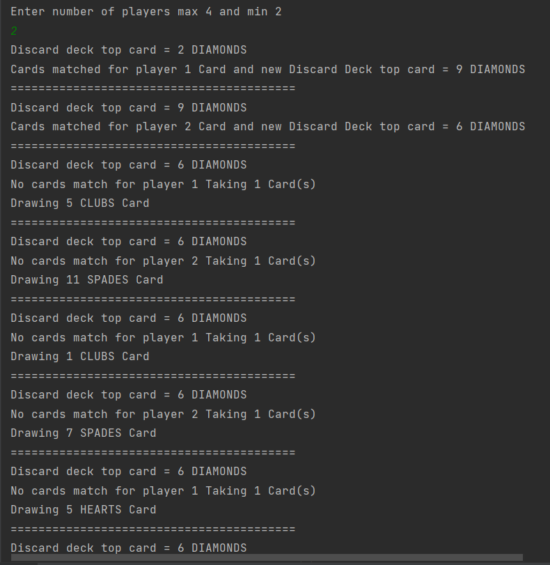
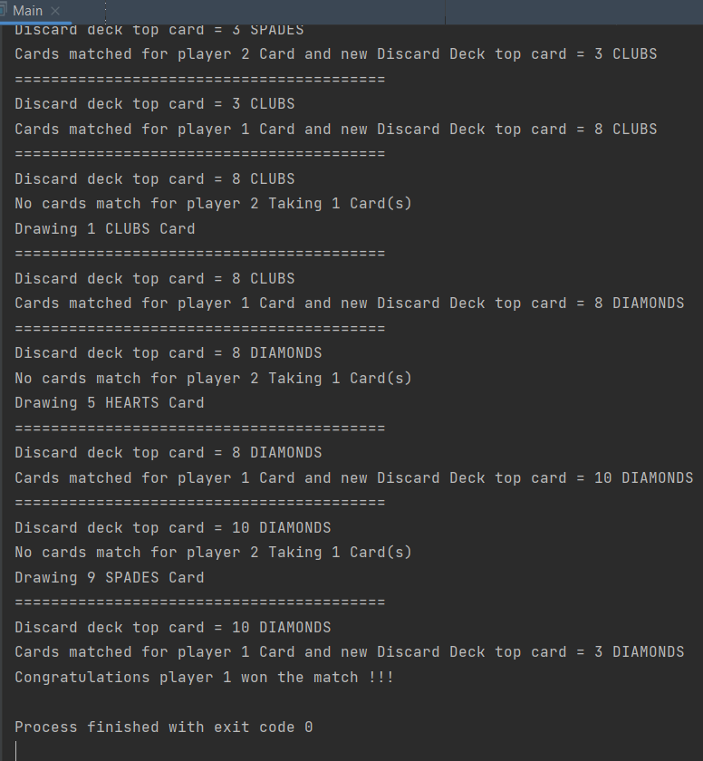

# Problem Statement.

Design a multiplayer card game that supports multiple players (up to 4) and different types of cards (e.g. number cards, action cards, etc.). The game should follow the following rules:

-  Each player starts with a hand of 5 cards.

- The game starts with a deck of 52 cards ( a standard deck of playing cards).

- Players take turns playing cards from their hand, following a set of rules that define what cards can be played when.

- A player can only play a card if it matches either the suit or the rank of the top card on the discard pile.

- If a player cannot play a card, they must draw a card from the draw pile. If the draw pile is empty, the game ends in a draw and no player is declared a winner..

- The game ends when one player runs out of cardswho is declared the winner.

BONUS: Aces, Kings, Queens and Jack are action cards. When one of these is played the following actions occur:

- Ace(A): Skip the next player in turn

- Kings(K): Reverse the sequence of who plays next 

- Queens(Q): +2

- Jacks(J): +4

NOTE: actions are not stackable i.e. if Q is played by player 1 then player two draws two cards and cannot play a Q from his hand on that turn even if available

## How to run the program.

Simply clone this repository on your local system and execute the Main class' main method --> (Main.main()) and give input 
on how many players you want the game to play for minimum = 2
and maximum = 4.

Runs on any kind of Environment which supports Java 1.8 or above.

Thank you!
## Screenshots

## Author

- [Mrityunjay Sarkar](https://github.com/MrityuNJ45)

## Contact Me

- [LinkedIn](https://www.linkedin.com/in/mrityunjay-sarkar45/)
- Email : mrityunjaysorcar@gmail.com
